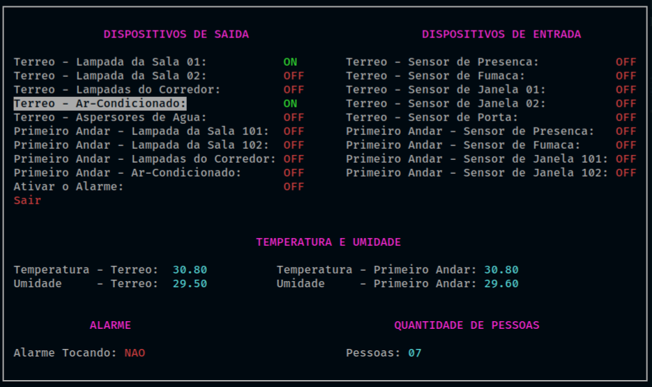
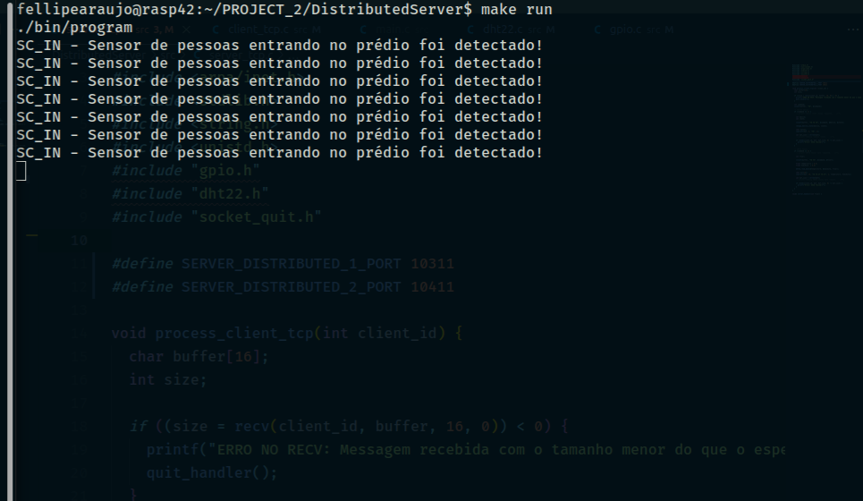
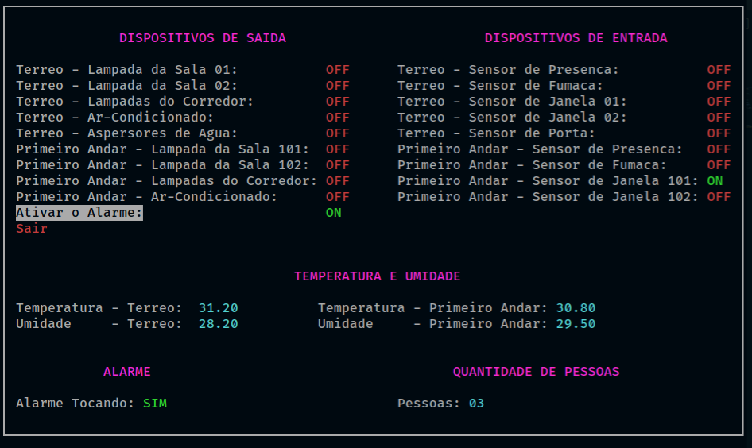
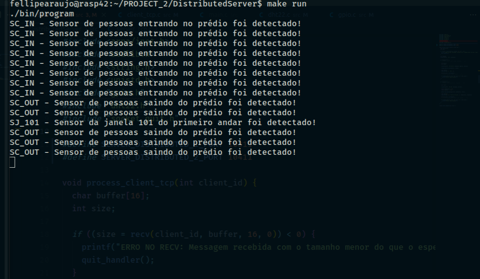
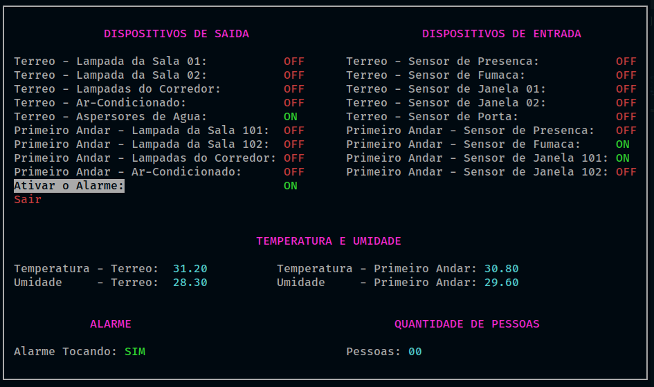
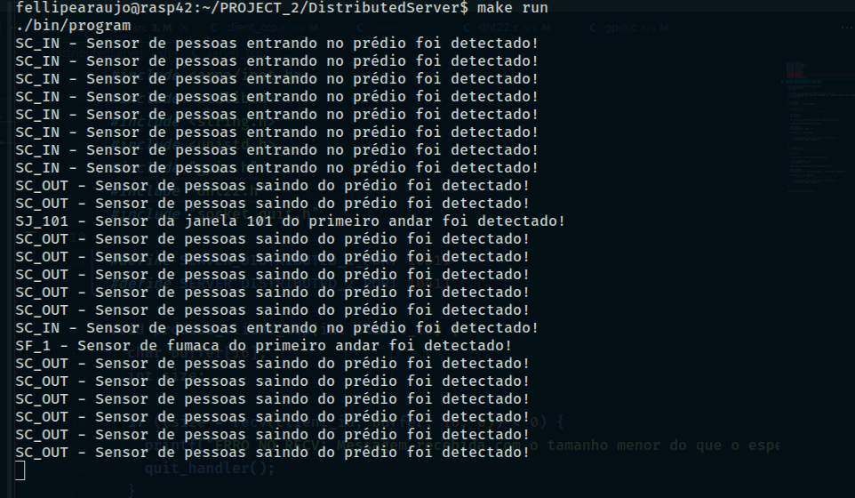
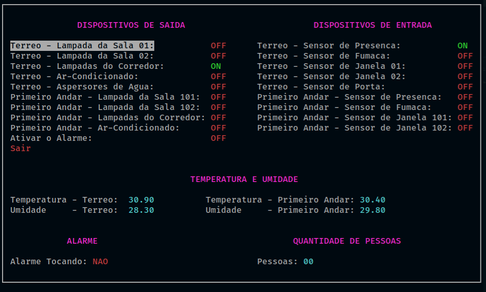
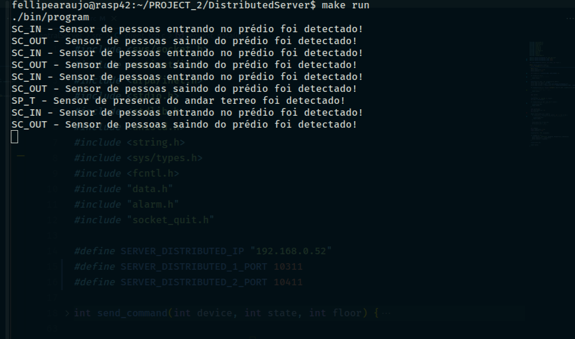

# Projeto 2 - FSE

## Introdução

Este projeto tem por objetivo a criação de um sistema distribuído de automação predial para monitoramento e acionamento de sensores e dispositivos de um prédio de 2 andares. O sistema foi desenvolvido para funcionar em um conjunto de placas Raspberry Pi com um servidor central responsável pelo controle e interface com o usuário e servidores distribuídos para leitura e acionamento dos dispositivos. Dentre os dispositivos envolvidos estão o monitoramento de temperatura e umidade, sensores de presença, sensores de fumaça, sensores de contagem de pessoas, sensores de abertura e fechamento de portas e janelas, acionamento de lâmpadas, aparelhos de ar-condicionado, alarme e aspersores de água em caso de incêndio.

## Dados do Aluno

| Nome | Matrícula |
| ---- | --------- |
| Fellipe dos Santos Araujo | 18/0063723 |

## Dependências

[WiringPi GPIO](http://wiringpi.com/)

[ncurses](https://invisible-island.net/ncurses/)

## Arquitetura do Sistema


## Sensores e Dispositivos


## Como Executar

Ao realizar o clone deste repositório em ambas placas Raspberry Pi, em cada um dos terminais, digite os comandos:

### Terminal 1 - Servidor Central

```bash
# Entrar na pasta do servidor central
$ cd CentralServer

# Compilar o projeto
$ make

# Executar o projeto
$ make run
```

### Terminal 2 - Servidor Distribuído

```bash
# Entrar na pasta do servidor distribuído
$ cd DistributedServer

# Compilar o projeto
$ make

# Executar o projeto
$ make run
```

***OBS: Executar primeiro o servidor central e, em seguida, executar o servidor distribuído.***

### Alteração de IP's e Portas (OPCIONAL)

Caso seja necessário alterar o ip ou as portas dos servidores central e distribuído, os valores estão declarados no início dos seguintes arquivos:

* `CentralServer/src/server_tcp.c`
* `CentralServer/src/client_tcp.c`
* `DistributedServer/src/server_tcp.c`
* `DistributedServer/src/client_tcp.c`

## Relatório - Dispositivos de Saída

O log dos comandos acionados dos dispositivos de saída se encontra na pasta `CentralServer/logs/data.csv`.

## Resultados

### Acionamento de dispositivos de saída.

* Servidor Central



* Servidor Distribuído



### Acionamento do alarme ao abrir uma janela

* Servidor Central



* Servidor Distribuído



### Acionamento do alarme e aspersor de água ao detectar fumaça

* Servidor Central



* Servidor Distribuído



### Acionamento da luz do corredor por 10 segundos ao detectar presença no andar

* Servidor Central



* Servidor Distribuído



## Referências

[DHT22](https://github.com/nebulx29/dht22)

[Biblioteca WiringPi GPIO](http://wiringpi.com/)

[Raspberry Pi Pinout](https://pinout.xyz/)

[Debounce](https://www.filipeflop.com/blog/debounce-o-que-e-e-como-resolver-via-software/)
